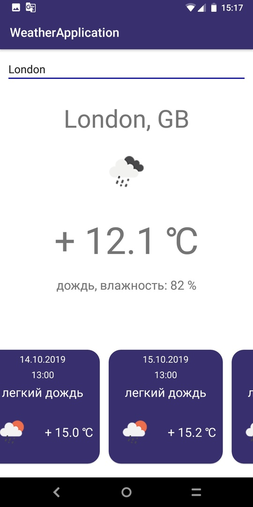
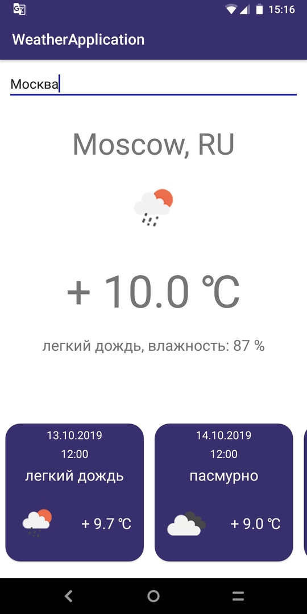
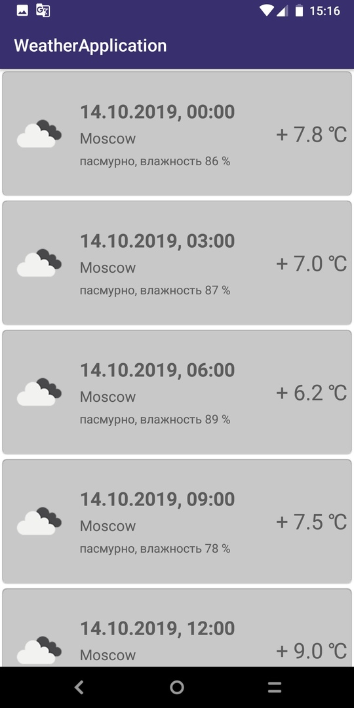

# android-weather-app
Android Kotlin Weather Application

This application uses https://openweathermap.org api to show current weather by city name and also forecast for 5 days.

Stack of technologies: Kotlin + rxKotlin + MVP + Retrofit

Version: 1.0

    
    
    

